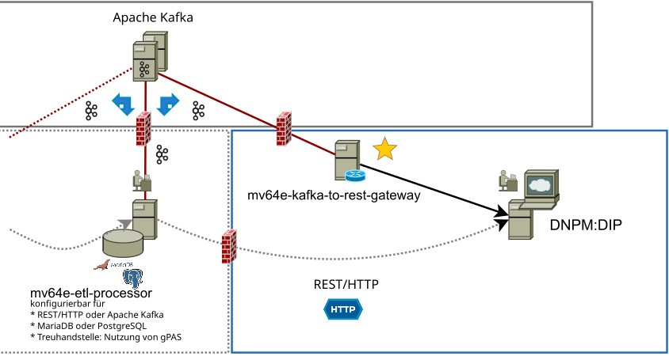

# MV64e Kafka-to-REST Gateway

Diese Anwendung nimmt Kafka Records entgegen und versendet MV64e HTTP requests mit DNPM V2.1 Payload an DNPM:DIP.

### Einordnung innerhalb einer DNPM-ETL-Strecke

Diese Anwendung erlaubt das Weiterleiten von Kafka-Records mit DNPM-Datenmodell 2.1 an DNPM:DIP und ist somit das
Gegenstück zu [mv64e-rest-to-kafka-gateway](https://github.com/pcvolkmer/mv64e-rest-to-kafka-gateway)

Verwendung im Zusammenspiel mit https://github.com/pcvolkmer/mv64e-etl-processor



## Konfiguration

Beim Start der Anwendung können Parameter angegeben werden.

```
Usage: mv64e-kafka-to-rest-gateway [OPTIONS] --dnpm-dip-uri <DNPM_DIP_URI>

Options:
      --bootstrap-servers <BOOTSTRAP_SERVERS>
          Kafka Bootstrap Server [env: KAFKA_BOOTSTRAP_SERVERS=] [default: kafka:9094]
      --topic <TOPIC>
          Kafka Topic [env: KAFKA_TOPIC=] [default: etl-processor_output]
      --response-topic <RESPONSE_TOPIC>
          Kafka Response Topic [env: KAFKA_RESPONSE_TOPIC=] [default: etl-processor_output_response]
      --group-id <GROUP_ID>
          Kafka Group ID [env: KAFKA_GROUP_ID=] [default: mv64e-kafka-to-rest-gateway]
      --dnpm-dip-uri <DNPM_DIP_URI>
          DNPM:DIP URI for API requests [env: DNPM_DIP_URI=]
      --dnpm-dip-username <DNPM_DIP_USERNAME>
          DNPM:DIP Username [env: DNPM_DIP_USERNAME=]
      --dnpm-dip-password <DNPM_DIP_PASSWORD>
          DNPM:DIP Password [env: DNPM_DIP_PASSWORD=]
      --dnpm-dip-ca-file <DNPM_DIP_CA_FILE>
          CA file for HTTPS connection to DNPM:DIP [env: DNPM_DIP_CA_FILE=]
      --ssl-ca-file <SSL_CA_FILE>
          CA file for SSL connection to Kafka [env: KAFKA_SSL_CA_FILE=]
      --ssl-cert-file <SSL_CERT_FILE>
          Certificate file for SSL connection to Kafka [env: KAFKA_SSL_CERT_FILE=]
      --ssl-key-file <SSL_KEY_FILE>
          Key file for SSL connection to Kafka [env: KAFKA_SSL_KEY_FILE=]
      --ssl-key-password <SSL_KEY_PASSWORD>
          The SSL key password [env: KAFKA_SSL_KEY_PASSWORD=]
```

Die Anwendung lässt sich auch mit Umgebungsvariablen konfigurieren.

* `KAFKA_BOOTSTRAP_SERVERS`: Zu verwendende Kafka-Bootstrap-Server als kommagetrennte Liste
* `KAFKA_TOPIC`: Zu verwendendes Topic zum Warten auf neue Anfragen. Standardwert: `etl-processor_output`
* `KAFKA_RESPONSE_TOPIC`: Zu verwendendes Topic zum Versenden von Antworten. Standardwert:
  `etl-processor_output_response`
* `KAFKA_GROUP_ID`: Die Kafka Group ID. Standardwert: `mv64e-kafka-to-rest-gateway`
* `DNPM_DIP_URI`: URI für DNPM:DIP API Requests (z.B. http://localhost/api)

Optionale Umgebungsvariablen für DNP:DIP - wenn angegeben wird ein eigene eigene RootCA für HTTPS-Verbindung
verwendet und angegebener Benutzername und Password benutzt.

* `DNPM_DIP_USERNAME`: Benutzername für DNPM:DIP (wenn erforderlich)
* `DNPM_DIP_PASSWORD`: Passwort für DNPM:DIP (wenn erforderlich)
* `DNPM_DIP_CA_FILE`: Angabe 

Optionale Umgebungsvariablen für Kafka - wenn angegeben wird eine SSL-Verbindung zu Kafka aufgebaut.

* `KAFKA_SSL_CA_FILE`: CA für SSL-Verbindungen
* `KAFKA_SSL_CERT_FILE`: SSL Certificate Datei
* `KAFKA_SSL_KEY_FILE`: SSL Key Datei
* `KAFKA_SSL_KEY_PASSWORD`: SSL Key Passwort (wenn benötigt)

## Anforderungen an eingehende Kafka-Records

Kafka-Records müssen eine(n)

* **Key** im JSON-Format mit einem Wert für `patientID` haben.
* **Header** mit Wert für`requestId` haben, damit eine ordnungsgemäße Zuordnung zu einer Anfrage im
  **mv64e-etl-processor** stattfinden kann.
  Ist dies nicht gegeben, kann die Rückantwort nicht einer eingehenden Anfrage zugeordnet werden.
  Anfragen ohne `requestId` im Header werden abgelehnt.
* **Payload** haben, die dem DNPM-Datenmodell 2.1 entspricht.

Zudem soll ein Kafka-Record einen **Header** mit Wert für `requestMethod` haben um zu bestimmen, welcher HTTP-Request
verwendet werden soll.
Der Wert kann entweder `POST` oder `DELETE` sein.
Ist der Header nicht angegeben, wird `POST` verwendet und entsprechend werden Patientendaten aktualisiert.
Bei einem `DELETE` werden die Patientendaten gelöscht.

Eine Prüfung auf MV- oder Forschungs-Consent findet nicht statt.

## HTTP-Requests zu DNPM:DIP

Kann ein HTTP-Request nicht beantwortet werden, wird der zugehörige Kafka-Record nicht quittiert.
Bei einem Neustart der Anwendung werden alle nicht quittierten Records erneut verarbeitet.

Eine Antwort wird über das Kafka-Response-Topic nur dann übertragen, wenn von DNPM:DIP eine der folgenden
HTTP-Status-Codes verwendet wurde:

| Case                                  | Status Code                                        |
|---------------------------------------|----------------------------------------------------|
| Data OK                               | `200 OK`                                           |
| Data acceptable with quality issues 	 | `201 Created` with JSON issue report               |
| Unacceptable Issues                   | `422 Unprocessable Content` with JSON issue report |
| Fatal Issues Detected                 | `400 Bad Request` with JSON issue report           |

Siehe auch: https://github.com/dnpm-dip/api-gateway/tree/main/app/controllers#upload-a-patient-record

Für alle anderen Status-Codes wird der eingehende Kafka-Record nicht quittiert und wird erneut bearbeitet werden.